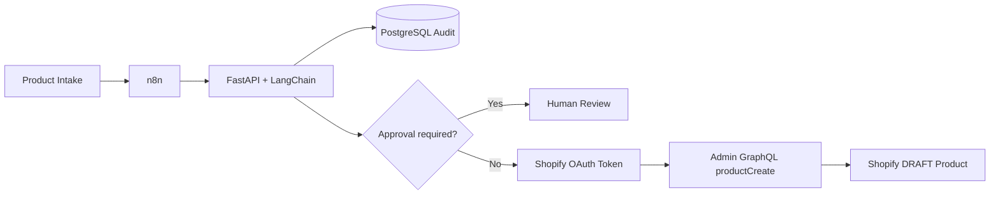

# AI Commerce Ops

End-to-end AI-assisted e-commerce operations workflow built as a portfolio proof project for a medical commerce automation role.

The system accepts supplier product data, enriches it with LangChain + OpenAI, applies deterministic validation and risk rules, writes an idempotent PostgreSQL audit record, and routes the result either to human review or to a real Shopify `DRAFT` product creation flow through the Admin GraphQL API.

## Architecture



## What this demonstrates

- n8n workflow orchestration with branching and retry behavior
- FastAPI service with Pydantic request / response contracts
- LangChain structured output with a real OpenAI model in `live` mode
- PostgreSQL audit logging with idempotent `ON CONFLICT` updates
- Human-in-the-loop routing for risky or incomplete catalog data
- Shopify Dev Dashboard authentication via client credentials
- Real Shopify Admin GraphQL `productCreate` calls with `DRAFT` status
- Deterministic `demo` mode for repeatable local testing
- Automated API and smoke tests

## Repository layout

```text
.
├── automation/
│   ├── api/                  # FastAPI + LangChain service
│   ├── examples/             # Ready / review sample payloads
│   ├── n8n/                  # Importable n8n workflow JSON
│   ├── docker-compose.yml
│   └── .env.example
├── src/                      # Remotion portfolio video source
├── CASE_STUDY_TR.md
└── package.json
```

## Quick start

```bash
cd automation
cp .env.example .env
# Fill only your own local secrets in .env
docker compose up --build
```

Then import `automation/n8n/ai-commerce-ops.workflow.json` into n8n.

API docs: `http://localhost:8000/docs`  
n8n: `http://localhost:5678`

See [`automation/README.md`](automation/README.md) for the complete workflow and Shopify setup.

## Security

No API keys, access tokens, client secrets, or production credentials are committed to this repository. `.env` files are ignored and `.env.example` contains placeholders only.

## Portfolio

**Mustafa Gencer**  
GitHub: https://github.com/mstfgncr23-eng  
LinkedIn: https://www.linkedin.com/in/mustafa-gencer-dev/
