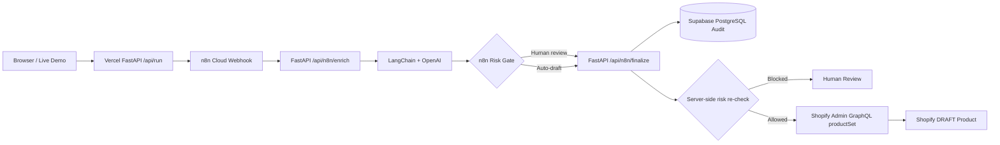

# AI Commerce Ops

AI-assisted e-commerce operations workflow that turns supplier product data into structured catalog content, evaluates operational/compliance risk, persists the decision trail, and conditionally syncs approved items to Shopify as `DRAFT` products.

**Live demo:** https://ai-commerce-ops-demo.vercel.app  
**Türkçe case study:** [CASE_STUDY_TR.md](CASE_STUDY_TR.md)

## What the workflow does

1. Receives a controlled supplier product payload.
2. Sends the product to a FastAPI + LangChain enrichment service.
3. Produces structured category, SEO copy, normalized product copy, risk score and risk flags.
4. Routes the result through an n8n Cloud human-in-the-loop risk gate.
5. Persists the input and decision payload to Supabase PostgreSQL.
6. If the product is safe for automation, upserts a real Shopify product as `DRAFT` through the Admin GraphQL API.
7. If human review is required, Shopify is blocked before any catalog write occurs.

## Live architecture



The n8n branch is the visible orchestration layer, while the backend re-checks the approval decision before Shopify so the risk gate cannot be bypassed by a modified request.

## Demo scenarios

| Scenario | Risk behavior | Final result |
|---|---|---|
| Disposable Exam Table Paper | Low-risk consumable | Supabase audit + Shopify `DRAFT` upsert |
| Portable Patient Monitor | Regulated / diagnostic monitoring context | Supabase audit + human review, Shopify blocked |
| Stainless Steel Clinic Trolley | Non-regulated clinic furniture | Supabase audit + Shopify `DRAFT` upsert |

These paths make the demo repeatable while still exercising the real orchestration, AI, database and Shopify integrations.

## Technology stack

- **n8n Cloud** for orchestration, branching and HTTP workflow execution
- **Python + FastAPI** for REST endpoints and server-side validation
- **LangChain** for structured LLM orchestration
- **OpenAI** for product enrichment and risk triage
- **Pydantic** for typed request/response and structured AI output contracts
- **Supabase PostgreSQL** for persistent JSONB audit records
- **Shopify Admin GraphQL API** for idempotent `DRAFT` product upserts
- **Vercel** for the live FastAPI deployment
- **GitHub** for source control and deployment integration

## Implementation details

- AI output is schema-constrained with Pydantic fields and validation limits.
- n8n HTTP nodes use retry behavior for transient failures.
- Risk routing combines model-produced risk signals with deterministic server-side rules.
- Regulated products or risk scores at/above the configured threshold require human review.
- Every finalized workflow attempts to persist an audit row containing the supplier input and decision payload.
- PostgreSQL writes use `ON CONFLICT` updates for idempotent audit persistence.
- Shopify uses a stable product handle and GraphQL `productSet`, so repeated demo runs update the same draft instead of creating duplicate catalog spam.
- Shopify writes are intentionally `DRAFT` only.
- Secrets are supplied through environment variables and are not committed to the repository.

## Repository layout

```text
.
├── live-demo/
│   ├── api/index.py          # FastAPI, LangChain, audit and Shopify integration
│   ├── app.py                # Vercel FastAPI entrypoint
│   ├── index.html            # Interactive live portfolio UI
│   └── requirements.txt
├── automation/
│   ├── api/                  # Original local FastAPI automation service
│   ├── examples/             # Sample ready/review payloads
│   ├── n8n/
│   │   ├── ai-commerce-ops.cloud.workflow.json
│   │   └── ai-commerce-ops.workflow.json
│   ├── docker-compose.yml
│   └── .env.example
├── src/                      # Remotion project/video source
├── CASE_STUDY_TR.md
└── package.json
```

## n8n workflow

For the cloud version used by the live demo, import:

```text
automation/n8n/ai-commerce-ops.cloud.workflow.json
```

The repository also contains the earlier local/Docker-oriented workflow at `automation/n8n/ai-commerce-ops.workflow.json`.

## Local automation stack

```bash
cd automation
cp .env.example .env
# Add only your own local credentials to .env
docker compose up --build
```

Then import the local workflow JSON into n8n. See [`automation/README.md`](automation/README.md) for the original local setup details.

## Security and scope

This repository contains no API keys, access tokens, client secrets or database passwords. `.env` files are ignored and example environment files contain placeholders only.

The project is a controlled portfolio demo. It performs product-content triage rather than medical advice, and automated Shopify writes are limited to `DRAFT` products.

## Author

**Mustafa Gencer**  
GitHub: https://github.com/mstfgncr23-eng  
LinkedIn: https://www.linkedin.com/in/mustafa-gencer-dev/
