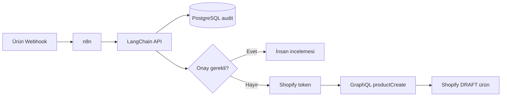

# AI Commerce Ops — uçtan uca otomasyon

Bu demo, medikal e-ticaret ürün kabul sürecini **n8n → LangChain/FastAPI → PostgreSQL → insan onayı veya gerçek Shopify DRAFT ürün kaydı** hattında modeller. Varsayılan `demo` modu AI kararını deterministik üretir; `live` modunda LangChain structured output kullanır. Shopify dalı, Dev Dashboard uygulaması üzerinden kısa ömürlü access token alıp GraphQL Admin API ile gerçek bir `DRAFT` ürün oluşturur.

## Mimari



## 1. Shopify Dev Dashboard uygulaması

API-only kullanım için sürüm oluştururken:

- App URL: `https://shopify.dev/apps/default-app-home`
- Shopify admin'e gömülü uygulama seçeneği: kapalı
- Webhooks API version: `2026-07`
- Required scope: `write_products`
- Optional scopes: boş
- Redirect URL'leri: client credentials akışında gerekmez

Sürümü **Release/Yayınla**, ardından Home sayfasından uygulamayı kendi mağazana kur. Son olarak **Settings** bölümündeki Client ID ve Client Secret değerlerini al. Secret'ı Git'e veya ekran görüntüsüne koyma.

## 2. Ortam değişkenlerini doldur

```bash
cp .env.example .env
```

`.env` içinde:

```dotenv
SHOPIFY_SHOP=your-store.myshopify.com
SHOPIFY_CLIENT_ID=...
SHOPIFY_CLIENT_SECRET=...
SHOPIFY_API_VERSION=2026-07
```

Shopify client-credentials token'ı yaklaşık 24 saat geçerlidir. Workflow her Shopify yazımından önce yeni token istediği için demo ortamında token yenileme elle yapılmaz. Production'da gereksiz token isteklerini azaltmak için token cache eklenebilir.

## 3. Çalıştır

```bash
docker compose up --build
```

- API sağlık kontrolü: `http://localhost:8000/health`
- API dokümantasyonu: `http://localhost:8000/docs`
- n8n: `http://localhost:5678`

## 4. n8n akışını içe aktar

n8n arayüzünde **Import from File** seçeneğiyle şu dosyayı aç:

`n8n/ai-commerce-ops.workflow.json`

Akışın düşük-risk dalı artık şu adımları gerçekten çalıştırır:

1. `Prepare Shopify Draft`
2. `Get Shopify Access Token`
3. `Create Shopify Draft Product`
4. `Shopify API Error?`
5. `Shopify Draft Created` veya `Shopify API Failed`

Test webhook'unu dinlemeye aldıktan sonra örnek isteği gönder:

```bash
curl -X POST http://localhost:5678/webhook-test/product-intake \
  -H 'Content-Type: application/json' \
  --data-binary @examples/product-ready.json
```

Başarılı sonuçta webhook cevabında `workflow_status: shopify_draft_created`, Shopify product GID ve `DRAFT` status'u görünür.

İnsan onayı dalını göstermek için:

```bash
curl -X POST http://localhost:5678/webhook-test/product-intake \
  -H 'Content-Type: application/json' \
  --data-binary @examples/product-review.json
```

## 5. Gerçek LangChain çağrısını aç

`.env` içinde:

```dotenv
AI_MODE=live
OPENAI_API_KEY=...
OPENAI_MODEL=gpt-5.6-luna
```

Ardından API servisini yeniden oluştur:

```bash
docker compose up --build api
```

`app/main.py`, `ChatOpenAI.with_structured_output(...)` ile Pydantic şemasına uyan karar üretir.

## 6. Hızlı kod testi

Docker gerektirmeyen karar testi:

```bash
python api/tests/smoke_test.py
```

API testleri için:

```bash
pytest -q api/tests/test_api.py
```

## Görüşmede gösterilecek kanıtlar

1. n8n webhook isteğinin iki karar dalından geçmesi
2. FastAPI `/docs` ekranında giriş ve structured output şemaları
3. Aynı SKU tekrar gönderildiğinde aynı `request_id` ve güncellenen PostgreSQL audit kaydı
4. Eksik görsel veya sıfır stokta human-in-the-loop dalı
5. Düşük-risk üründe Shopify GraphQL Admin API üzerinden gerçek `DRAFT` ürün oluşturulması
6. Shopify cevabındaki product GID'nin n8n çıktısına dönmesi

## Kapsam ve güvenlik

- Shopify Client Secret yalnızca `.env` içinde tutulur; `.env.example` secret içermez.
- Workflow secret'ı export JSON içine gömmez.
- Uygulama minimum `write_products` scope'u ile çalışır.
- Ürün `DRAFT` olarak oluşturulur; otomatik olarak satış kanalında yayınlanmaz.
- GraphQL `userErrors` ayrıca kontrol edilir; HTTP 200 tek başına başarı kabul edilmez.
- Tıbbi sertifika veya klinik iddia model tarafından uydurulmamalıdır; riskli kayıtlar insan onayına düşer.

## Resmî referanslar

- [Shopify Dev Dashboard apps](https://shopify.dev/docs/apps/build/dev-dashboard/create-apps-using-dev-dashboard)
- [Shopify client credentials grant](https://shopify.dev/docs/apps/build/authentication-authorization/access-tokens/client-credentials-grant)
- [Shopify productCreate](https://shopify.dev/docs/api/admin-graphql/latest/mutations/productCreate)
- [LangChain structured output](https://docs.langchain.com/oss/python/langchain/structured-output)
- [n8n workflow JSON import/export](https://docs.n8n.io/build/manage-workflows/export-and-import/)
